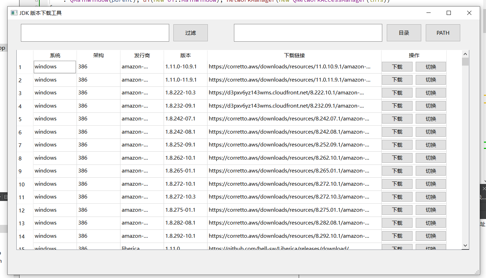

# Jabba-qt - JDK 版本下载工具

**Jabba-qt** 是一款基于 Qt 开发的本地桌面应用，用于浏览、选择并下载不同系统平台（Windows/Linux/macOS）、架构（x86/x64/arm64）及发行商（Zulu/OpenJDK 等）的 JDK 版本。

## 🚀 功能特性

- 支持多平台：**Windows**, **Linux**, **macOS**
- 支持多种 CPU 架构：**x86**, **x64**, **arm64**
- 多种发行商支持：**Zulu**, **OpenJDK**
- 查看可用 JDK 版本列表
- 一键下载 JDK 安装包或压缩包
- 后续计划：一键切换本地 JDK 版本（目前仅实现占位函数）

## 📁 项目结构

```
jabba-qt/
├── README.md                  # 本文件
├── main.cpp                   # Qt 应用入口
├── mainwindow.cpp/h           # 主窗口逻辑，负责加载 JSON 并展示表格数据
├── ui_mainwindow.h            # Qt Designer UI 文件
├── index.json                 # 存储 JDK 版本及下载链接的配置文件
└── 其他 Qt 相关资源文件（如 .pro, .qrc 等）
```

## 📄 数据格式要求

应用程序依赖 [index.json](file://d:\Documents\jabba\index.json) 提供 JDK 下载信息，其格式如下：

```json
{
    "windows": {
        "x64": {
            "zulu@x64": {
                "17.0.9": "https://example.com/zulu17-x64-win.zip",
                "21.0.1": "https://example.com/zulu21-x64-win.zip"
            }
        }
    },
    "linux": {
        "x64": {
            "openjdk@x64": {
                "11.0.22": "https://example.com/openjdk11-x64-linux.tar.gz"
            }
        }
    }
}
```

## ⚙️ 使用说明

1. 准备好 [index.json](file://d:\Documents\jabba\index.json) 文件，并放置在项目根目录。
2. 使用 [Qt Creator](https://www.qt.io/download) 打开 [.pro](file://d:\Documents\jabba\jabba.pro) 文件进行构建。
3. 编译完成后运行程序，主界面将自动加载并展示 JDK 版本信息。
4. 点击“下载”按钮即可保存对应的 JDK 包到本地路径。

## 🛠️ 开发与构建

### 构建环境要求

- 已安装 [Qt Creator](https://www.qt.io/download)
- 配置好编译器环境（如 MinGW 或 MSVC）

### 构建步骤

1. 打开 [jabba-qt.pro](file://d:\Documents\jabba\jabba.pro) 文件
2. 点击左下角的构建按钮或使用快捷键 `Ctrl+Shift+B`
3. 成功构建后点击运行按钮启动应用

## 📷 截图预览（示例）



